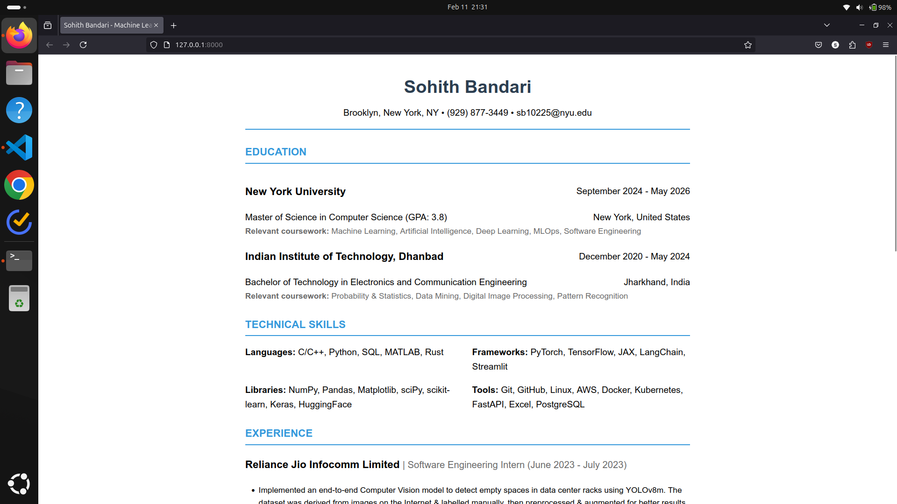

# swe-assignment-1



# Project Setup Guide
This guide will help you set up and run the project locally.

**Prerequisites:**

- Python 3.12

## Installation Steps
First, clone the repository
```
git clone https://github.com/Billa-Man/swe-assignment-1.git
cd swe-assignment-1
```

### 1. Virtual Environment Setup
Create and activate a Python virtual environment:
```
# Create virtual environment
python3 -m venv swe-asgn1

# Activate virtual environment
# For Unix/macOS
source swe-asgn1/bin/activate

# For Windows
# swe-asgn1\Scripts\activate
```

### 2. Dependencies Installation
Install all required packages:
```
pip install -r requirements.txt
```

# Usage
Simply run the following code in your project directory after activating the environment:
```
python3 manage.py runserver
```
